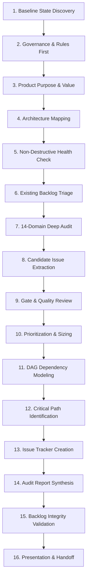

# Universal Repository Audit & Backlog Architect

<p align="center">
  
</p>

<p align="center">
  <strong>Deep first-principles repository inspection, 14-domain gap analysis, and execution-ready DAG backlog architecture for AI coding agents and engineering teams.</strong>
</p>

<p align="center">
  <a href="LICENSE"></a>
  <a href="https://github.com/imMamdouhaboammar/universal-repo-audit-backlog-architect"></a>
  <a href="https://github.com/imMamdouhaboammar/universal-repo-audit-backlog-architect"></a>
  <a href="https://github.com/imMamdouhaboammar/universal-repo-audit-backlog-architect"></a>
</p>

---

## Overview

When dropped into a codebase, typical AI agents jump directly into premature code edits, patch symptoms without diagnosing root causes, or emit vague wishlists like *"improve tests"* or *"refactor architecture"*.

**Universal Repository Audit & Backlog Architect** transforms your agent into a Staff Software Engineer, Software Architect, Technical Product Manager, QA Lead, Security Reviewer, and Repository Maintainer:

- **Strict Read-Only Mutation Boundary**: Never modifies, patches, or breaks application code during an audit.
- **16-Phase Systematic Lifecycle**: Traces repository health from git baseline discovery to acyclic dependency DAG synthesis.
- **14 Technical & Product Domains**: Exhaustively inspects correctness, security, performance, data integrity, testing, CI/CD, DX, and product gaps.
- **Single-Session Vertical Tracer Slices**: Decomposes large initiatives into discrete, independently verifiable tickets ($XS$ to $L$) executable in a fresh context window.
- **Binary Falsifiable Acceptance Criteria**: Every issue requires concrete, observable checkboxes (`- [ ]`) and a verification strategy.

---

## The 16-Phase Audit Lifecycle



1. **Establish Real State**: Git branches, dirty working tree, active commits, and tooling configurations.
2. **Read Repository Rules First**: Ingest `AGENTS.md`, `CLAUDE.md`, `CONTRIBUTING.md`, and code conventions.
3. **Understand What the Product Actually Is**: Product goals, user journeys, and core problem space.
4. **Determine Real Architecture**: Boundary maps, data stores, API boundaries, and runtime topologies.
5. **Safely Verify Health**: Run tests, linters, and typechecks non-destructively; record all errors.
6. **Inspect Existing Backlog**: De-duplicate against existing issues and active pull requests.
7. **Exhaustive Domain Evaluation**: Audit across all 14 technical domains.
8. **Synthesize Candidate Issues**: Transform raw findings into structured candidate tickets.
9. **Gate Every Finding**: Verify against the 8-question gating checklist.
10. **Prioritize & Size**: Assign P0–P3 priorities and $XS$–$L$ effort sizing (decompose $XL$).
11. **Construct Dependency DAG**: Model explicit upstream (`Blocked by: #X`) and downstream (`Blocks: #Y`) links.
12. **Identify Critical Path**: Highlight the sequential chain unlocking maximum system value.
13. **Create Issue Tracker Items**: Emit standard tracker issues or save local markdown files.
14. **Assemble Backlog Report**: Build executive summary, health scorecards, and Mermaid DAG.
15. **Validate Backlog Integrity**: Enforce acyclic graph topology, binary criteria, and evidence labels.
16. **Deliver Executive & Technical Handoff**: Present high-level findings and direct issue links.

---

## The 14 Audit Domains

| Domain | Focus Area | Key Inspection Criteria |
| :--- | :--- | :--- |
| **A. Correctness & Bugs** | Runtime errors & defects | Broken tests, edge cases, race conditions, silent failure swallowing |
| **B. Security** | Vulnerabilities & compliance | OWASP Top 10, auth bypasses, injection, credential leakage, RLS |
| **C. Reliability** | Fault tolerance & recovery | Connection timeouts, retry storms, unhandled rejections, deadlocks |
| **D. Performance** | Latency & resource efficiency | $N+1$ queries, unbounded memory growth, blocking I/O, heavy bundles |
| **E. Data Integrity** | Storage & state consistency | Missing schema migrations, missing foreign keys, race updates |
| **F. Testing & QA** | Test suite effectiveness | Missing integration tests, high-risk un-tested paths, flaky tests |
| **G. Architecture** | System design & modularity | God classes, circular dependencies, violated boundaries |
| **H. Developer Experience** | Toolchain & local dev speed | Slow builds, broken dev scripts, obscure onboarding steps |
| **I. CI/CD & Automation** | Deployment pipelines | Missing test runners in CI, flaky pipelines, insecure secrets in CI |
| **J. Observability** | Monitoring & debugging | Missing structured logs, missing metrics, lack of correlation IDs |
| **K. Accessibility & UX** | Usability & user standards | Broken keyboard navigation, missing ARIA tags, UX papercuts |
| **L. Documentation** | Onboarding & accuracy | Stale READMEs, missing environment setup guides, drifting API docs |
| **M. Product Gaps** | Core user value delivery | Half-built features, broken user journeys, obvious missing capabilities |
| **N. Spikes & RFCs** | Architectural uncertainty | High-risk unknown technology evaluations requiring bounded spikes |

---

## Five Backlog Groups

Every backlog is organized into five distinct operational groups:

1. **Group 1: Must-Fix Defects (P0 / P1)** — Production blockers, vulnerabilities, data loss, test failures.
2. **Group 2: Core Product Completeness** — Missing user journeys, essential MVP features, incomplete flows.
3. **Group 3: Architectural Foundation & Tech Debt** — Prefactoring, decoupling, database integrity, schema migrations.
4. **Group 4: Quality, Testing & Operational Excellence** — Integration tests, observability, CI/CD, developer speed.
5. **Group 5: Future Enhancements & Exploratory Spikes** — Advanced features, performance experiments, bounded spikes.

---

## Canonical Issue Specification

Every issue generated must follow this canonical structure:

```markdown
### Summary
One to three clear sentences stating what needs to be done and why.

### Classification
- **Type**: Bug Fix | Feature | Technical Debt | Performance | Security | Testing | Documentation | Architecture | CI/CD | DX | Observability | Accessibility | Spike/RFC
- **Priority**: P0 | P1 | P2 | P3
- **Severity**: Critical | High | Medium | Low
- **Confidence**: High | Medium | Low
- **Estimated Effort**: XS | S | M | L
- **Implementation Readiness**: Ready to implement | Blocked | Needs refinement

### Problem Statement & Business/Technical Impact
Detailed description of the issue, current behavior, and why it matters.

### Evidence & Reproduction
- **Status**: CONFIRMED | INFERRED | PROPOSED
- **Traces**: Logs, reproduction steps, command outputs, or source code links.

### Affected Components & Scope
List of explicit files and directories affected.

### Non-Goals / Explicit Out-of-Scope
Explicit boundaries of what will NOT be addressed in this ticket.

### Dependencies & Sequencing
- **Blocked by**: #X, #Y
- **Blocks**: #Z

### Testing Strategy & Verification Plan
- Unit tests to add/modify.
- Integration tests or end-to-end verification.
- Specific terminal command to confirm fix.

### Acceptance Criteria
- [ ] Observable binary condition 1
- [ ] Observable binary condition 2
- [ ] Specific automated test passes
```

---

## Installation & Host Setup

### 1. Agent Skills (Gemini CLI / Antigravity)
```bash
git clone https://github.com/imMamdouhaboammar/universal-repo-audit-backlog-architect.git ~/.gemini/config/skills/universal-repo-audit-backlog-architect
ln -sfn ~/.gemini/config/skills/universal-repo-audit-backlog-architect ~/.gemini/config/skills/repo-audit-backlog-architect
```

### 2. OpenAI Codex Plugin
```bash
# Install to Codex plugins directory
git clone https://github.com/imMamdouhaboammar/universal-repo-audit-backlog-architect.git ~/.codex/plugins/universal-repo-audit-backlog-architect
# Install to Codex skills directory
ln -sfn ~/.codex/plugins/universal-repo-audit-backlog-architect ~/.codex/skills/universal-repo-audit-backlog-architect
```
Enable the plugin in `~/.codex/config.toml`:
```toml
[plugins."universal-repo-audit-backlog-architect@local-marketplace"]
enabled = true
```

### 3. ChatGPT & Custom GPTs
1. Create a new GPT in **ChatGPT -> Explore GPTs -> Create a GPT**.
2. Copy the instructions from [`submission/chatgpt-instructions.md`](universal-repo-audit-backlog-architect/submission/chatgpt-instructions.md).
3. Set avatar to [`assets/plugin-mark.svg`](universal-repo-audit-backlog-architect/assets/plugin-mark.svg).
4. Enable **Code Interpreter** and **Web Search**.

### 4. Claude Code
```bash
git clone https://github.com/imMamdouhaboammar/universal-repo-audit-backlog-architect.git ~/.claude/skills/universal-repo-audit-backlog-architect
```

---

## Repository Structure

```text
universal-repo-audit-backlog-architect/
├── .codex-plugin/
│   └── plugin.json                     # Codex plugin manifest
├── plugin.json                         # Root manifest for host compatibility
├── SKILL.md                            # Complete 16-phase orchestrator
├── skill-spec.json                     # Machine-readable specification
├── assets/
│   ├── plugin-mark.svg                 # High-resolution vector plugin icon
│   └── backlog-report-template.md      # Executive and technical report template
├── references/
│   ├── domain-audit-guide.md           # 14 technical domain inspection guides
│   ├── issue-templates.md              # Canonical issue templates (Bug, Security, Perf, etc.)
│   ├── dependency-and-dag.md           # DAG construction, tracer slicing, single-session sizing
│   ├── triage-and-priority.md          # P0-P3 definitions, severity vs priority, 5 groups
│   └── evidence-and-safety.md          # Read-only boundaries, credential redaction rules
├── scripts/
│   ├── extract_repo_snapshot.py        # Safe read-only repo introspection utility
│   └── validate_backlog.py             # Schema, binary checkbox, and DFS DAG cycle checker
├── submission/
│   ├── openai-plugin.json              # OpenAI Platform submission descriptor
│   ├── test-cases.json                 # Automated review test cases
│   ├── chatgpt-instructions.md         # Custom GPT & ChatGPT system prompt
│   └── README.md                       # Distribution and submission guide
├── evals/
│   └── evals.json                      # 11 comprehensive evaluation scenarios
└── tests/
    └── fixtures/sample_issue.md        # Test issue fixture for automated validation
```

---

## Validation & Testing

```bash
# Validate backlog issues, markdown tables, and DAG acyclicity
python3 universal-repo-audit-backlog-architect/scripts/validate_backlog.py universal-repo-audit-backlog-architect/tests/fixtures/sample_issue.md

# Extract safe read-only repository snapshot
python3 universal-repo-audit-backlog-architect/scripts/extract_repo_snapshot.py .

# Run Omni-Skill cross-platform portability suite
python3 ~/.gemini/config/skills/omni-skill/scripts/validate_portability.py universal-repo-audit-backlog-architect --targets agent-skills,claude-code,chatgpt,codex
```

---

## Security & Privacy

- **Read-Only**: Strictly enforces zero modifications to target application code.
- **Redaction**: Automatically flags and redacts exposed credentials, tokens, and secrets.
- **Safe Exploits**: Categorizes vulnerabilities without generating operational attack payloads.

---

## License

[MIT](LICENSE) © 2026 [Mamdouh Aboammar](https://github.com/imMamdouhaboammar)
