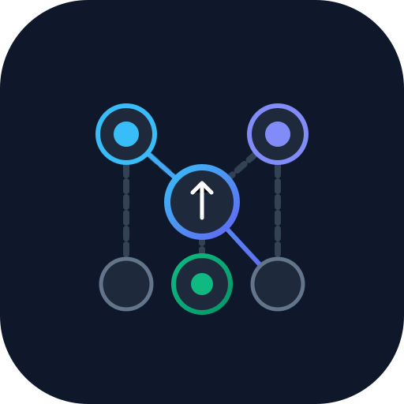
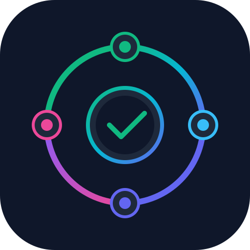

# Autonomous Engineering Suite: Audit, Backlog Architecture & Delivery Agency

<p align="center">
  
  &nbsp;&nbsp;&nbsp;&nbsp;&nbsp;&nbsp;&nbsp;&nbsp;
  
</p>

<p align="center">
  <strong>A complete, closed-loop autonomous software engineering suite for AI coding agents and human teams: First-principles 14-domain repository auditing, dependency DAG backlog architecture, and an autonomous issue-to-merge delivery agency.</strong>
</p>

<p align="center">
  <a href="LICENSE"></a>
  <a href="https://github.com/imMamdouhaboammar/universal-repo-audit-backlog-architect/actions/workflows/ci.yml"></a>
  <a href="https://skills.sh"></a>
  <a href="https://bun.sh"></a>
  <a href="https://github.com/imMamdouhaboammar/universal-repo-audit-backlog-architect"></a>
  <a href="https://github.com/imMamdouhaboammar/universal-repo-audit-backlog-architect"></a>
  <a href="https://github.com/imMamdouhaboammar/universal-repo-audit-backlog-architect"></a>
  <a href="https://github.com/imMamdouhaboammar/universal-repo-audit-backlog-architect"></a>
</p>

---

## The Autonomous Engineering Lifecycle

This repository provides two deeply integrated, complementary modules compliant with the **Omni-Skill** standard:

```mermaid
flowchart LR
    subgraph Module1 ["Module 1: Backlog Architect"]
        A["Repository Baseline"] --> B["14-Domain Deep Audit"]
        B --> C["DAG Backlog Synthesis"]
        C --> D["Execution-Ready Issues"]
    end

    subgraph Module2 ["Module 2: Autonomous Delivery Agency"]
        D --> E["Select & Validate Issue"]
        E --> F["Workspace Isolation & Contract"]
        F --> G["TDD RED-to-GREEN"]
        G --> H["Atomic Commits & Verification"]
        H --> I["Independent Review & Repair"]
        I --> J["PR Creation & CI Monitoring"]
        J --> K["Authorized Merge & Health Check"]
        K --> L["Issue Closure & Delivery Receipt"]
        L --> M["Refresh Queue & Next Issue"]
        M --> E
    end
```



1. **[Module 1: Universal Repository Audit & Backlog Architect](universal-repo-audit-backlog-architect/SKILL.md)**: Deeply inspects codebases from first principles without modifying source code, audits 14 engineering domains, and constructs a prioritized, dependency-aware DAG backlog of execution-ready issues.
2. **[Module 2: Autonomous Issue Delivery Agency](autonomous-issue-delivery-agency/SKILL.md)**: Operates as an autonomous senior software engineering agency across repository backlogs, taking one actionable issue at a time through execution, TDD, atomic commits, verification, independent review, PR creation, CI monitoring, authorized merge, default branch post-merge health checks, and durable closure receipts.

---

## Module 1: Universal Repository Audit & Backlog Architect

- **Strict Read-Only Boundary**: Never mutates or breaks application code during an audit.
- **16-Phase Systematic Lifecycle**: Traces repository health from git baseline discovery to acyclic dependency DAG synthesis.
- **14 Technical & Product Domains**: Exhaustively inspects correctness, security, performance, data integrity, testing, CI/CD, DX, and product gaps.
- **Single-Session Vertical Tracer Slices**: Decomposes large initiatives into discrete, independently verifiable tickets ($XS$ to $L$) executable in a single session.
- **Binary Falsifiable Acceptance Criteria**: Every issue requires concrete, observable checkboxes (`- [ ]`) and an automated verification command.

### The 14 Audit Domains

| Domain | Focus Area | Key Inspection Criteria |
| :--- | :--- | :--- |
| **A. Correctness & Bugs** | Runtime errors & defects | Broken tests, edge cases, race conditions, silent failure swallowing |
| **B. Security** | Vulnerabilities & compliance | OWASP Top 10, auth bypasses, injection, credential leakage, RLS |
| **C. Reliability** | Fault tolerance & recovery | Connection timeouts, retry storms, unhandled rejections, deadlocks |
| **D. Performance** | Latency & resource efficiency | $N+1$ queries, unbounded memory growth, blocking I/O, heavy bundles |
| **E. Data Integrity** | Storage & state consistency | Missing schema migrations, missing foreign keys, race updates |
| **F. Testing & QA** | Test suite effectiveness | Missing integration tests, high-risk un-tested paths, flaky tests |
| **G. Architecture** | System design & modularity | God classes, circular dependencies, violated boundaries |
| **H. Developer Experience** | Toolchain & local dev speed | Slow builds, broken dev scripts, obscure onboarding steps |
| **I. CI/CD & Automation** | Deployment pipelines | Missing test runners in CI, flaky pipelines, insecure secrets in CI |
| **J. Observability** | Monitoring & debugging | Missing structured logs, missing metrics, lack of correlation IDs |
| **K. Accessibility & UX** | Usability & user standards | Broken keyboard navigation, missing ARIA tags, UX papercuts |
| **L. Documentation** | Onboarding & accuracy | Stale READMEs, missing environment setup guides, drifting API docs |
| **M. Product Gaps** | Core user value delivery | Half-built features, broken user journeys, obvious missing capabilities |
| **N. Spikes & RFCs** | Architectural uncertainty | High-risk unknown technology evaluations requiring bounded spikes |

---

## Module 2: Autonomous Issue Delivery Agency

$$\text{Issue} \rightarrow \text{Implement} \rightarrow \text{Verify} \rightarrow \text{Review} \rightarrow \text{PR} \rightarrow \text{Merge} \rightarrow \text{Close} \rightarrow \text{Document} \rightarrow \text{Repeat}$$

- **Strict Single Active Issue Rule**: Exactly ONE repository issue in active implementation at a time.
- **Single Write Owner**: Specialists inspect concurrently, but exactly ONE write owner mutates application source and active branches.
- **Dirty Worktree Preservation**: Never destroys, overwrites, or discards uncommitted user changes. Isolate work in dedicated branches or worktrees.
- **TDD for Behavioral Changes**: Establishes a falsifiable RED test that fails for the true defect before writing minimal GREEN code.
- **Atomic Commit Protocol**: One coherent purpose per commit, Conventional Commits style, associated tests included.
- **Circuit Breaker (Failure Recovery)**: If the same behavior fails after two consecutive attempts, STOP mutating. Freeze failure, hypothesize, and isolate root causes.
- **Verification Freshness Law**: Any source code edit immediately invalidates prior verification evidence.
- **Never Bypass Repository Protections**: Respect required CI, branch rulesets, merge queues, and code reviews even when administrative permissions exist.
- **Authorized Merge & Post-Merge Health**: Verifies PR is `MERGED` on remote, checks default branch health, and posts a durable delivery receipt comment to the closed issue.

---

## Installation & Host Setup

### 1. Skills.sh (Instant Hub Install)
```bash
npx skills add imMamdouhaboammar/universal-repo-audit-backlog-architect
```

### 2. Universal Multi-Agent One-Liner (Local)
```bash
# Clone and run the universal installer across Claude, Antigravity, Codex, Cursor, and Agent Kernel
git clone https://github.com/imMamdouhaboammar/universal-repo-audit-backlog-architect.git
cd universal-repo-audit-backlog-architect && ./install.sh
```

### 3. Zero-Install CLI (npx & Bun)
```bash
# View suite modules and agent compatibility
npx universal-repo-audit-backlog-architect info

# Run safe 14-domain repository snapshot
npx universal-repo-audit-backlog-architect audit .

# Validate issue DAG acyclicity & checkboxes
bunx universal-repo-audit-backlog-architect validate-backlog ./tests/fixtures/sample_issue.md
```

### 4. Agent Skills (Gemini CLI / Antigravity)
```bash
# Clone the repository
git clone https://github.com/imMamdouhaboammar/universal-repo-audit-backlog-architect.git ~/.gemini/config/skills/autonomous-engineering-suite

# Link Module 1: Backlog Architect
ln -sfn ~/.gemini/config/skills/autonomous-engineering-suite/universal-repo-audit-backlog-architect ~/.gemini/config/skills/universal-repo-audit-backlog-architect

# Link Module 2: Delivery Agency
ln -sfn ~/.gemini/config/skills/autonomous-engineering-suite/autonomous-issue-delivery-agency ~/.gemini/config/skills/autonomous-issue-delivery-agency
```

### 5. OpenAI Codex Plugins
```bash
# Install Module 1 Plugin
mkdir -p ~/.codex/plugins/universal-repo-audit-backlog-architect
cp -R universal-repo-audit-backlog-architect-codex-plugin/. ~/.codex/plugins/universal-repo-audit-backlog-architect/

# Install Module 2 Plugin
mkdir -p ~/.codex/plugins/autonomous-issue-delivery-agency
cp -R autonomous-issue-delivery-agency-codex-plugin/. ~/.codex/plugins/autonomous-issue-delivery-agency/
```
Enable both plugins in `~/.codex/config.toml`:
```toml
[plugins."universal-repo-audit-backlog-architect@local-marketplace"]
enabled = true

[plugins."autonomous-issue-delivery-agency@local-marketplace"]
enabled = true
```

### 6. ChatGPT & Custom GPTs
- **Module 1 GPT**: Create GPT with instructions from [`universal-repo-audit-backlog-architect/submission/chatgpt-instructions.md`](universal-repo-audit-backlog-architect/submission/chatgpt-instructions.md) and avatar [`universal-repo-audit-backlog-architect/assets/plugin-mark.svg`](universal-repo-audit-backlog-architect/assets/plugin-mark.svg).
- **Module 2 GPT**: Create GPT with instructions from [`autonomous-issue-delivery-agency/submission/chatgpt-instructions.md`](autonomous-issue-delivery-agency/submission/chatgpt-instructions.md) and avatar [`autonomous-issue-delivery-agency/assets/plugin-mark.svg`](autonomous-issue-delivery-agency/assets/plugin-mark.svg).
- Enable **Code Interpreter** and **Web Search**.

### 7. Claude Code & Cursor
```bash
ln -sfn $(pwd)/universal-repo-audit-backlog-architect ~/.claude/skills/universal-repo-audit-backlog-architect
ln -sfn $(pwd)/autonomous-issue-delivery-agency ~/.claude/skills/autonomous-issue-delivery-agency
```

---

## Repository Structure

```text
.
├── SKILL.md                                           # Master root orchestrator (Omni-Skill compliant)
├── package.json                                       # Multi-agent package & binary definition
├── marketplace.json                                   # Claude Plugin & Marketplace manifest
├── .skills.json                                       # Skills.sh registry manifest
├── install.sh                                         # Universal multi-agent installer
├── bin/
│   └── cli.js                                         # Executable zero-install CLI runner
├── universal-repo-audit-backlog-architect/            # Module 1: Backlog Architect
│   ├── .codex-plugin/plugin.json                      # Codex manifest
│   ├── plugin.json                                    # Platform manifest
│   ├── SKILL.md                                       # 16-phase audit lifecycle orchestrator
│   ├── skill-spec.json                                # Universal SkillSpec
│   ├── assets/                                        # Vector mark and report templates
│   ├── references/                                    # 14-domain guides, DAG, triage, safety
│   ├── scripts/                                       # extract_repo_snapshot.py, validate_backlog.py
│   ├── submission/                                    # ChatGPT instructions & test cases
│   └── tests/                                         # Test fixtures
│
├── autonomous-issue-delivery-agency/                  # Module 2: Delivery Agency
│   ├── .codex-plugin/plugin.json                      # Codex manifest
│   ├── plugin.json                                    # Platform manifest
│   ├── SKILL.md                                       # 20-phase delivery loop orchestrator
│   ├── skill-spec.json                                # Universal SkillSpec
│   ├── assets/                                        # Vector mark, contract & receipt templates
│   ├── references/                                    # State machine, specialist matrix, gates
│   ├── scripts/                                       # validate_delivery_contract.py, run_agency_snapshot.py
│   ├── submission/                                    # ChatGPT instructions & test cases
│   ├── evals/                                         # 12 evaluation scenarios
│   └── tests/                                         # Fixtures and Python unittest suite
│
├── universal-repo-audit-backlog-architect-codex-plugin/ # Codex packaging wrapper for Module 1
├── autonomous-issue-delivery-agency-codex-plugin/       # Codex packaging wrapper for Module 2
├── tests/
│   └── cli.test.ts                                    # Bun CLI & distribution test suite
├── .github/
│   ├── ISSUE_TEMPLATE/                                # Issue templates (audit finding, delivery task)
│   └── workflows/ci.yml                               # CI matrix validating Bun, Python, and manifests
├── CONTRIBUTING.md                                    # Development and validation guidelines
├── LICENSE                                            # MIT License
└── SECURITY.md                                        # Security policy
```

---

## Local Validation & Quality Gates

Run all automated quality gates across both modules:

```bash
# 1. Validate all JSON manifests
python3 -c "import json, glob; [json.load(open(f)) for f in glob.glob('*/**/*.json', recursive=True) if 'node_modules' not in f]; print('✓ All JSON manifests valid')"

# 2. Module 1: Backlog validator and repo snapshot test
python3 universal-repo-audit-backlog-architect/scripts/validate_backlog.py universal-repo-audit-backlog-architect/tests/fixtures/sample_issue.md
python3 universal-repo-audit-backlog-architect/scripts/extract_repo_snapshot.py .

# 3. Module 2: Contract validator, receipt validator, snapshot test, and unit tests
python3 autonomous-issue-delivery-agency/scripts/validate_delivery_contract.py --contract autonomous-issue-delivery-agency/tests/fixtures/sample_contract.md
python3 autonomous-issue-delivery-agency/scripts/validate_delivery_contract.py --receipt autonomous-issue-delivery-agency/tests/fixtures/sample_receipt.md
python3 autonomous-issue-delivery-agency/scripts/run_agency_snapshot.py .
python3 -m unittest discover -s autonomous-issue-delivery-agency/tests -p "test_*.py"

# 4. Omni-Skill cross-platform portability verification
python3 ~/.gemini/config/skills/omni-skill/scripts/validate_portability.py universal-repo-audit-backlog-architect --targets agent-skills,claude-code,chatgpt,codex
python3 ~/.gemini/config/skills/omni-skill/scripts/validate_portability.py autonomous-issue-delivery-agency --targets agent-skills,claude-code,chatgpt,codex
```

---

## License

[MIT](LICENSE) © 2026 [Mamdouh Aboammar](https://github.com/imMamdouhaboammar)
