# Universal Autonomous Engineering Suite

A complete, closed-loop autonomous software engineering suite for AI coding agents and human teams: First-principles 14-domain repository auditing, dependency DAG backlog architecture, and an autonomous issue-to-merge delivery agency.

```mermaid
flowchart LR
    subgraph Module1 ["Module 1: Backlog Architect"]
        A["Repository Baseline"] --> B["14-Domain Deep Audit"]
        B --> C["DAG Backlog Synthesis"]
        C --> D["Execution-Ready Issues"]
    end

    subgraph Module2 ["Module 2: Autonomous Delivery Agency"]
        D --> E["Select & Validate Issue"]
        E --> F["Workspace Isolation & Contract"]
        F --> G["TDD RED-to-GREEN"]
        G --> H["Atomic Commits & Verification"]
        H --> I["Independent Review & Repair"]
        I --> J["PR Creation & CI Monitoring"]
        J --> K["Authorized Merge & Health Check"]
        K --> L["Issue Closure & Delivery Receipt"]
        L --> M["Refresh Queue & Next Issue"]
        M --> E
    end
```



---

## ⚡ Mode Router

| Mode | Trigger Intent | Execution Engine | Primary Output |
|---|---|---|---|
| **AUDIT & ARCHITECT** | "audit this repo", "find bugs", "build backlog", "review architecture" | [Module 1: Backlog Architect](universal-repo-audit-backlog-architect/SKILL.md) | 14-domain audit report, acyclic DAG, canonical issue tickets |
| **AUTONOMOUS DELIVERY** | "deliver issue #X", "work on next ticket", "autonomous agency loop" | [Module 2: Delivery Agency](autonomous-issue-delivery-agency/SKILL.md) | Work contract, RED/GREEN TDD, verified PR, merged code, closure receipt |
| **CLOSED-LOOP PIPELINE** | "audit and fix highest priority issue", "run full agency pipeline" | Sequential Chaining (1 $\rightarrow$ 2) | Audit $\rightarrow$ Backlog DAG $\rightarrow$ Priority 1 issue isolated, implemented, and merged |

---

## Non-Negotiable Invariants

1. **Read-Only Audit Boundary**: Never mutate, patch, or alter application source code during an audit. Introspection must remain completely safe and non-destructive.
2. **Strict Single Active Issue Rule**: When operating in delivery mode, exactly ONE repository issue may be in active implementation at a time.
3. **Single Write Owner**: Concurrent specialists may inspect and review, but exactly ONE write owner mutates application source and active branches.
4. **Dirty Worktree Preservation**: Never destroy, discard, or overwrite uncommitted user changes. Isolate work in dedicated branches or git worktrees.
5. **TDD for Behavioral Changes**: For bug fixes, new features, and logic changes, establish a falsifiable RED test that fails for the true reason before writing minimal GREEN code.
6. **Atomic Commit Protocol**: Every commit must have one coherent purpose, follow Conventional Commits (`feat:`, `fix:`, `test:`, `refactor:`, `docs:`), and include corresponding tests.
7. **Circuit Breaker (Failure Recovery)**: If the same behavior fails after two materially similar attempts, STOP mutating. Freeze failure, reproduce, falsify hypotheses, and find the root cause.
8. **Verification Freshness Law**: Any source code edit invalidates previous verification evidence. No completion claim may cite stale output.
9. **Never Bypass Repository Protections**: Respect required CI, branch rulesets, merge queues, and code reviews even when administrative permissions exist.
10. **Merge is Not the End**: An iteration is finished only when the PR is verified as `MERGED` on remote, the default branch health is confirmed, and a durable delivery receipt is recorded on the issue.

---

## Module 1: Universal Repository Audit & Backlog Architect

Operate across **14 Technical & Product Domains**:

- **A. Correctness & Bugs**: Runtime defects, edge cases, race conditions, silent failure swallowing.
- **B. Security**: OWASP Top 10, auth boundaries, credential leakage, RLS bypasses, sanitization.
- **C. Reliability**: Connection timeouts, retry storms, unhandled rejections, deadlocks, fallbacks.
- **D. Performance**: $N+1$ queries, unbounded memory growth, blocking I/O, heavy bundle assets.
- **E. Data Integrity**: Schema migrations, missing foreign keys, transaction boundaries, race updates.
- **F. Testing & QA**: Test suite coverage, high-risk un-tested paths, flaky tests, assertion fidelity.
- **G. Architecture**: System design, god classes, circular dependencies, violated boundaries.
- **H. Developer Experience**: Toolchain, build latency, broken dev scripts, local onboarding friction.
- **I. CI/CD & Automation**: Deployment pipelines, automated check coverage, environment secrets.
- **J. Observability**: Structured logs, metrics, correlation IDs, error reporting pipelines.
- **K. Accessibility & UX**: Usability standards, keyboard navigation, ARIA tags, UX papercuts.
- **L. Documentation**: Accuracy, onboarding guides, environment setup, API synchronization.
- **M. Product Gaps**: Missing user journeys, half-built features, obvious user friction points.
- **N. Spikes & RFCs**: Architectural uncertainties requiring bounded technical spikes.

See [`universal-repo-audit-backlog-architect/SKILL.md`](universal-repo-audit-backlog-architect/SKILL.md) and [`universal-repo-audit-backlog-architect/references/`](universal-repo-audit-backlog-architect/references/) for full 16-phase audit guides.

---

## Module 2: Autonomous Issue Delivery Agency

Operate the **20-Phase Autonomous Delivery Loop**:

$$\text{Issue} \rightarrow \text{Implement} \rightarrow \text{Verify} \rightarrow \text{Review} \rightarrow \text{PR} \rightarrow \text{Merge} \rightarrow \text{Close} \rightarrow \text{Document} \rightarrow \text{Repeat}$$

- **Phase 01**: Agency director activates, inspects issue queue and selects highest priority unblocked ticket.
- **Phase 02**: Task clarification, explicit scope definition, and non-goals demarcation.
- **Phase 03**: Workspace isolation (dedicated feature branch or worktree), clean git state verification.
- **Phase 04**: Implementation contract written with falsifiable acceptance criteria.
- **Phase 05**: RED test creation proving bug/gap before touching source code.
- **Phase 06-10**: Minimal GREEN implementation, unit & integration verification, clean code pass.
- **Phase 11-13**: Independent code review, security review, regression checking.
- **Phase 14-16**: Pull request generation, PR description with traceability, CI pipeline monitoring.
- **Phase 17-18**: Authorized merge verification, remote default branch sync and health checks.
- **Phase 19-20**: Issue closure receipt posted, task artifacts archived, queue refreshed for next issue.

See [`autonomous-issue-delivery-agency/SKILL.md`](autonomous-issue-delivery-agency/SKILL.md) and [`autonomous-issue-delivery-agency/references/`](autonomous-issue-delivery-agency/references/) for complete lifecycle specifications.

---

## Local Verification Commands

```bash
# 1. Run all test suites
bun test

# 2. Module 1: Backlog validator and repo snapshot test
python3 universal-repo-audit-backlog-architect/scripts/validate_backlog.py universal-repo-audit-backlog-architect/tests/fixtures/sample_issue.md
python3 universal-repo-audit-backlog-architect/scripts/extract_repo_snapshot.py .

# 3. Module 2: Contract validator, receipt validator, snapshot test, and unit tests
python3 autonomous-issue-delivery-agency/scripts/validate_delivery_contract.py --contract autonomous-issue-delivery-agency/tests/fixtures/sample_contract.md
python3 autonomous-issue-delivery-agency/scripts/validate_delivery_contract.py --receipt autonomous-issue-delivery-agency/tests/fixtures/sample_receipt.md
python3 autonomous-issue-delivery-agency/scripts/run_agency_snapshot.py .
python3 -m unittest discover -s autonomous-issue-delivery-agency/tests -p "test_*.py"

# 4. Omni-Skill cross-platform portability verification
python3 ~/.gemini/config/skills/omni-skill/scripts/validate_portability.py universal-repo-audit-backlog-architect --targets agent-skills,claude-code,chatgpt,codex
python3 ~/.gemini/config/skills/omni-skill/scripts/validate_portability.py autonomous-issue-delivery-agency --targets agent-skills,claude-code,chatgpt,codex
```
