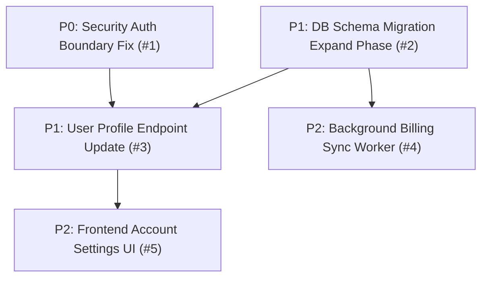

# Backlog Dependency Graph, Slicing & DAG Architecture

This reference guides the construction of a mature, dependency-aware backlog. A backlog is not a flat list of disconnected tickets; it is an executable Directed Acyclic Graph (DAG) that guides implementation sequencing and enables parallel execution.

---

## 1. The Directed Acyclic Graph (DAG) Invariant

Every repository backlog must form a valid DAG.

- **Explicit links**: Every dependency must be stated using `Blocked by: #X` and `Blocks: #Y`.
- **No cycles**: A cycle ($A \rightarrow B \rightarrow C \rightarrow A$) halts autonomous execution and creates deadlock. Always verify topological validity.
- **Minimal required edges**: Link issues only when a hard technical dependency exists (e.g., schema migration required before endpoint update). Do not create artificial dependencies that block parallelization.

---

## 2. Vertical Slicing Rule

For implementation-ready product and feature work, **always prefer vertical tracer slices** over horizontal layer fragmentation.

### Bad: Horizontal Layer Fragmentation
- Issue 1: "Add database tables for comments" (untestable in isolation)
- Issue 2: "Create comment API endpoints" (unverifiable by users)
- Issue 3: "Build comment frontend component" (blocked on everything)

*Result*: High integration friction, delayed feedback, partial features stranded in branches.

### Good: Vertical Tracer Slices
- Issue 1: "User can post and view a plain-text comment on an article" (includes schema, API endpoint, minimal UI surface, end-to-end test).
- Issue 2: "User can delete their own comment with confirmation modal" (builds on working slice).
- Issue 3: "User can format comments with Markdown" (enhancement on verified slice).

*Result*: Every completed issue delivers an independently verifiable outcome and immediate value.

---

## 3. The Single-Session Sizing Rule

An implementation Issue must fit comfortably inside **one focused coding-agent session** (or 1 engineer half-day/full-day).

### Sizing Indicators
- **XS**: Single file tweak, typo fix, small config update (< 30 minutes).
- **S**: Bounded function/component fix with regression test (< 2 hours).
- **M**: Standard vertical slice: model + API + unit/integration tests (< 4 hours).
- **L**: Multi-component subsystem or migration phase (< 1 day).
- **XL**: **Must be decomposed.** An XL issue exceeds agent context limits and causes hallucinations, missed edges, or stalled sessions.

### How to Decompose an XL Issue
1. Create a **Parent Initiative Issue**.
2. Break into ordered child issues representing distinct stages or vertical slices.
3. Establish dependencies between children.

---

## 4. The Prefactoring Rule

When implementing high-value work is dangerous because the existing code structure is brittle, tightly coupled, or lacks boundaries:

1. **Do NOT lump the refactoring into the feature ticket.** That inflates PR blast radius and obfuscates review.
2. **Create a narrow Preparatory Refactor Issue ("Prefactoring").**
   - Goal: Change the code structure to make the subsequent feature trivial to implement safely.
   - Invariant: **Strictly preserve observable behavior.** No feature additions in the refactor.
   - Verification: Existing test suites must pass 100% without modification.
   - Dependencies: Blocks the feature ticket; blocked by nothing.

---

## 5. Wide Migrations: Expand -> Migrate -> Contract

For database schema changes, public API migrations, or core interface deprecations, structure the backlog into three staged tickets:

1. **Stage 1: Expand** (Additive changes only)
   - Add new table, column, or API version alongside the old one.
   - Support dual-writing or backward-compatible read fallbacks.
   - Deploy safely without downtime or breaking existing clients.
2. **Stage 2: Migrate** (Data and consumer migration)
   - Backfill existing data to the new schema.
   - Migrate callers and clients to consume the new interface.
   - Monitor error rates and parity.
3. **Stage 3: Contract** (Cleanup and deprecation)
   - Remove legacy columns, deprecated routes, or compatibility shims.
   - Enforce non-nullable constraints and clean up obsolete tests.

---

## 6. Topological Execution Ordering

When presenting the recommended execution order in the final report:

1. **Critical Path**: Sequence of dependent issues that dictate minimum time to completion (usually P0 Security/Reliability -> Foundations -> Core Features).
2. **Parallel Tracks**: Independent clusters of work that can be executed concurrently by multiple agents or engineers without merge conflicts.
